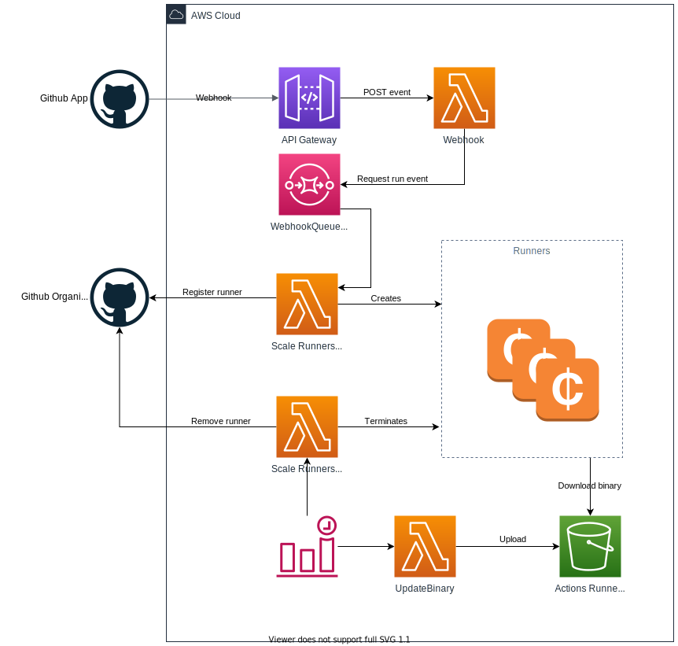

# setup-self-hosted-runner-aws-ec2

[](https://github.com/jonico/awesome-runners)

IssueOps example on how to set up an autoscaling, self-hosted runner fleet in AWS using [philips-labs/terraform-aws-github-runner](https://github.com/philips-labs/terraform-aws-github-runner)



In order to setup or modify an auto-scaling runner set, just [create an issue](https://octodemo.com/baseline/setup-self-hosted-runner-aws-ec2/issues/new/choose):


... /approve the generated Terraform plan in the resulting pull request and follow the instructions shown in the PR comment:


The PR comment will also contain an example GitHub Actions workflow to test the scaling of your newly created setup:


### Using custom images

The amiFilter and amiOwner fields can be used to specify an alternative runner image. Please use a filter that matches an AMI available in your region. An example for a custom AMI can be found [here](custom-images/actions-runner-with-additional-packages.json). You can create a new image using packer like this:

```bash
packer build  -var "aws_access_key=$AWS_ACCESS_KEY"  -var "aws_secret_key=$AWS_SECRET_KEY"  custom-images/actions-runner-with-additional-packages.json
```

# Setting up a copy of this IssueOps based repository

If you like to work directly with this repository, there is no further need but to follow the comments in the issues created by the template and the approved PR.

If you like to setup a copy of this repository somewhere else, you would need to set the following GitHub Action credentials:

* APP_CLIENT_SECRET: GitHub App client secret
* APP_KEY_BASE64: GitHub App private key, base64 encoded
* APP_ID: GitHub App Id
* APP_CLIENT_ID: GitHub App Client ID
* ENTERPRISE_SERVER_URL: GitHub Enterprise Server URL - leave blank if you are using GitHub.com
* AWS_ACCESS_KEY_ID: AWS access key id used to apply Terraform plans
* AWS_SECRET_ACCESS_KEY: AWS secret access key used to apply the Terraform plans

Furthermore, you would have to adopt [the Terraform state backend configuration](actions-runner-envs/default/backend.tf) to an S3 bucket and DynamoDB table of your choice. A Terraform configuration that shows how to create your own S3 bucket and table can be found [here](bootstrap-terraform-state-bucket/).

You also need to create a GitHub App as described in the next section.

### Needed issue labels

Last but not least, you would need to create two labels in the copy of this repository: `self-hosted-runner-scale-set` and `delete-self-hosted-runner-scale-set`

### How to create the GitHub App and architecture motivation

The rest of this README has been copied from the [philips-labs/terraform-aws-github-runner](https://github.com/philips-labs/terraform-aws-github-runner) project to provide additional information on the setup that is created and how to create the needed GitHub App if you like to start from scratch.

# Terraform module for scalable self hosted GitHub action runners <!-- omit in toc -->

This [Terraform](https://www.terraform.io/) module creates the required infrastructure needed to host [GitHub Actions](https://github.com/features/actions) self hosted, auto scaling runners on [AWS spot instances](https://aws.amazon.com/ec2/spot/). It provides the required logic to handle the life cycle for scaling up and down using a set of AWS Lambda functions. Runners are scaled down to zero to avoid costs when no workflows are active.

## Motivation

GitHub Actions `self hosted` runners provide a flexible option to run CI workloads on infrastructure of your choice. Currently there is no option provided to automate the creation and scaling of action runners. This module takes care of creating the AWS infrastructure to host action runners on spot instances. It provides lambda modules to orchestrate the life cycle of the action runners.

Lambda is chosen as runtime for two major reasons. First it allows to create small components with minimal access to AWS and GitHub. Secondly it provides a scalable setup with minimal costs that works on repo level and scales to organization level. The lambdas will create Linux based EC2 instances with Docker to serve CI workloads that can run on Linux and/or Docker. The main goal is to support Docker based workloads.

A logical question would be why not Kubernetes? In the current approach we stay close to the way the GitHub action runners are available today. The approach is to install the runner on a host where the required software is available. With this setup we stay quite close to the current GitHub approach. Another logical choice would be AWS Auto Scaling groups. This choice would typically require much more permissions on instance level to GitHub. And besides that, scaling up and down is not trivial.

## Overview

The moment a GitHub action workflow requiring a `self-hosted` runner is triggered, GitHub will try to find a runner which can execute the workload. This module reacts to GitHub's [`check_run` event](https://docs.github.com/en/free-pro-team@latest/developers/webhooks-and-events/webhook-events-and-payloads#check_run) for the triggered workflow and creates a new runner if necessary.

For receiving the `check_run` event, a GitHub App needs to be created with a webhook to which the event will be published. Installing the GitHub App in a specific repository or all repositories ensures the `check_run` event will be sent to the webhook.

In AWS a [API gateway](https://docs.aws.amazon.com/apigateway/index.html) endpoint is created that is able to receive the GitHub webhook events via HTTP post. The gateway triggers the webhook lambda which will verify the signature of the event. This check guarantees the event is sent by the GitHub App. The lambda only handles `check_run` events with status `created`. The accepted events are posted on a SQS queue. Messages on this queue will be delayed for a configurable amount of seconds (default 30 seconds) to give the available runners time to pick up this build.

The "scale up runner" lambda is listening to the SQS queue and picks up events. The lambda runs various checks to decide whether a new EC2 spot instance needs to be created. For example, the instance is not created if the build is already started by an existing runner, or the maximum number of runners is reached.

The Lambda first requests a registration token from GitHub which is needed later by the runner to register itself. This avoids that the EC2 instance, which later in the process will install the agent, needs administration permissions to register the runner. Next the EC2 spot instance is created via the launch template. The launch template defines the specifications of the required instance and contains a [`user_data`](https://docs.aws.amazon.com/AWSEC2/latest/UserGuide/user-data.html) script. This script will install the required software and configure it. The registration token for the action runner is stored in the parameter store (SSM) from which the user data script will fetch it and delete it once it has been retrieved. Once the user data script is finished the action runner should be online and the workflow will start in seconds.

Scaling down the runners is at the moment brute-forced, every configurable amount of minutes a lambda will check every runner (instance) if it is busy. In case the runner is not busy it will be removed from GitHub and the instance terminated in AWS. At the moment there seems no other option to scale down more smoothly.

Downloading the GitHub Action Runner distribution can be occasionally slow (more than 10 minutes). Therefore a lambda is introduced that synchronizes the action runner binary from GitHub to an S3 bucket. The EC2 instance will fetch the distribution from the S3 bucket instead of the internet.

Secrets and private keys which are passed to the lambdas as environment variables are encrypted by default by a KMS key managed by the module. Alternatively you can pass your own KMS key. Encryption via KMS can be complete disabled by setting `encrypt_secrets` to `false`.


Permission are managed on several places. Below the most important ones. For details check the Terraform sources.

- The GitHub App requires access to actions and publish `check_run` events to AWS.
- The scale up lambda should have access to EC2 for creating and tagging instances.
- The scale down lambda should have access to EC2 to terminate instances.

Besides these permissions, the lambdas also need permission to CloudWatch (for logging and scheduling), SSM and S3.

## Usages

The module supports two main scenarios for creating runners. On repository level a runner will be dedicated to only one repository, no other repository can use the runner. On organization level you can use the runner(s) for all the repositories within the organization. See https://help.github.com/en/actions/hosting-your-own-runners/about-self-hosted-runners for more information. The IssueOps part of this project so far only exposes the org runner aspect of the underlying Terraform module.

GitHub workflows fail immediately if there is no action runner available for your builds. Since this module supports scaling down to zero, builds will fail in case there is no active runner available. We recommend to create an offline runner with matching labels to the configuration. Create this runner manually by following the GitHub instructions for adding a new runner on your local machine. If you stop the process after the step of running the `config.sh` script the runner will remain offline. This offline runner ensures that builds will not fail immediately and stay queued until there is an EC2 runner to pick it up.

The setup consists of running Terraform to create all AWS resources and manually configuring the GitHub App. The Terraform module requires configuration from the GitHub App and the GitHub app requires output from Terraform. Therefore you first create the GitHub App and configure the basics, then run Terraform (via IssueOps), and afterwards finalize the configuration of the GitHub App.

### Setup GitHub App (part 1 - only needed if you like to start from scratch)

Go to GitHub and create a new app. Beware you can create apps your organization or for a user. For now we support only organization level apps.

1. Create app in Github
2. Choose a name
3. Choose a website (mandatory, not required for the module).
4. Disable the webhook for now (we will configure this later).
5. Permissions for all runners:
  - Repository:
    - `Actions`: Read-only (check for queued jobs)
    - `Checks`: Read-only (receive events for new builds)
    - `Metadata`: Read-only (default/required)
6. _Permissions for repo level runners only_:
  - Repository:
    - `Administration`: Read & write (to register runner)
7. _Permissions for organization level runners only_:
  - Organization
    - `Administration`: Read & write (to register runner)
    - `Self-hosted runners`: Read & write (to register runner)
8. Save the new app.
9. On the General page, make a note of the "App ID" and "Client ID" parameters.
10. Create a new client secret and also write it down.
11. Generate a new private key and save the `app.private-key.pem` file.

### Setup GitHub App (part 2 - only needed if you start from scratch)

Go back to the GitHub App and update the following settings.

1. Enable the webhook.
2. Provide the webhook url, should be part of the output of the IssueOps generated pull request you /approve.
3. Provide the webhook secret.
4. Enable the `check_run` event for the webhook.
5. In the "Install App" section, install the App in your organization, either in all or in selected repositories.

You are now ready to run action workloads on self hosted runner. Remember that builds will fail if there is no (offline) runner available with matching labels.


## Debugging

In case the setup does not work as intended follow the trace of events:

- In the GitHub App configuration, the Advanced page displays all webhook events that were sent.
- In AWS CloudWatch, every lambda has a log group. Look at the logs of the `webhook` and `scale-up` lambdas.
- In AWS SQS you can see messages available or in flight.
- Once an EC2 instance is running, you can connect to it in the EC2 user interface using Session Manager. Check the user data script using `cat /var/log/user-data.log`. By default several log files of the instances are streamed to AWS CloudWatch, look for a log group named `<environment>/runners`. In the log group you should see at least the log streams for the user data installation and runner agent.
- Registered instances should show up in the Settings - Actions page of the repository or organization (depending on the installation mode).


## Inputs

The IssueOps template only exposes a couple of configuration parameters, you can fine tune man< more if you manually edit the generated Terraform PR:

| Name | Description | Type | Default | Required |
|------|-------------|------|---------|:--------:|
| ami\_filter | List of maps used to create the AMI filter for the action runner AMI. By default amazon linux 2 is used. | `map(list(string))` | `{}` | no |
| ami\_owners | The list of owners used to select the AMI of action runner instances. | `list(string)` | <pre>[<br>  "amazon"<br>]</pre> | no |
| aws\_region | AWS region. | `string` | n/a | yes |
| block\_device\_mappings | The EC2 instance block device configuration. Takes the following keys: `device_name`, `delete_on_termination`, `volume_type`, `volume_size`, `encrypted`, `iops` | `map(string)` | `{}` | no |
| cloudwatch\_config | (optional) Replaces the module default cloudwatch log config. See https://docs.aws.amazon.com/AmazonCloudWatch/latest/monitoring/CloudWatch-Agent-Configuration-File-Details.html for details. | `string` | `null` | no |
| create\_service\_linked\_role\_spot | (optional) create the serviced linked role for spot instances that is required by the scale-up lambda. | `bool` | `false` | no |
| enable\_cloudwatch\_agent | Enabling the cloudwatch agent on the ec2 runner instances, the runner contains default config. Configuration can be overridden via `cloudwatch_config`. | `bool` | `true` | no |
| enable\_organization\_runners | n/a | `bool` | n/a | yes |
| enable\_ssm\_on\_runners | Enable to allow access the runner instances for debugging purposes via SSM. Note that this adds additional permissions to the runner instances. | `bool` | `false` | no |
| encrypt\_secrets | Encrypt secret variables for lambda's such as secrets and private keys. | `bool` | `true` | no |
| environment | A name that identifies the environment, used as prefix and for tagging. | `string` | n/a | yes |
| ghes\_url | GitHub Enterprise Server URL. Example: https://github.internal.co - DO NOT SET IF USING PUBLIC GITHUB | `string` | `null` | no |
| github\_app | GitHub app parameters, see your github app. Ensure the key is the base64-encoded `.pem` file (the output of `base64 app.private-key.pem`, not the content of `private-key.pem`). | <pre>object({<br>    key_base64     = string<br>    id             = string<br>    client_id      = string<br>    client_secret  = string<br>    webhook_secret = string<br>  })</pre> | n/a | yes |
| idle\_config | List of time period that can be defined as cron expression to keep a minimum amount of runners active instead of scaling down to 0. By defining this list you can ensure that in time periods that match the cron expression within 5 seconds a runner is kept idle. | <pre>list(object({<br>    cron      = string<br>    timeZone  = string<br>    idleCount = number<br>  }))</pre> | `[]` | no |
| instance\_profile\_path | The path that will be added to the instance\_profile, if not set the environment name will be used. | `string` | `null` | no |
| instance\_type | Instance type for the action runner. | `string` | `"m5.large"` | no |
| key\_name | Key pair name | `string` | `null` | no |
| kms\_key\_id | Custom KMS key to encrypted lambda secrets, if not provided and `encrypt_secrets` = `true` a KMS key will be created by the module. Secrets will be encrypted with a context `Environment = var.environment`. | `string` | `null` | no |
| lambda\_s3\_bucket | S3 bucket from which to specify lambda functions. This is an alternative to providing local files directly. | `any` | `null` | no |
| lambda\_security\_group\_ids | List of subnets in which the action runners will be launched, the subnets needs to be subnets in the `vpc_id`. | `list(string)` | `[]` | no |
| lambda\_subnet\_ids | List of subnets in which the action runners will be launched, the subnets needs to be subnets in the `vpc_id`. | `list(string)` | `[]` | no |
| logging\_retention\_in\_days | Specifies the number of days you want to retain log events for the lambda log group. Possible values are: 0, 1, 3, 5, 7, 14, 30, 60, 90, 120, 150, 180, 365, 400, 545, 731, 1827, and 3653. | `number` | `180` | no |
| manage\_kms\_key | Let the module manage the KMS key. | `bool` | `true` | no |
| minimum\_running\_time\_in\_minutes | The time an ec2 action runner should be running at minimum before terminated if non busy. | `number` | `5` | no |
| role\_path | The path that will be added to role path for created roles, if not set the environment name will be used. | `string` | `null` | no |
| role\_permissions\_boundary | Permissions boundary that will be added to the created roles. | `string` | `null` | no |
| runner\_additional\_security\_group\_ids | (optional) List of additional security groups IDs to apply to the runner | `list(string)` | `[]` | no |
| runner\_allow\_prerelease\_binaries | Allow the runners to update to prerelease binaries. | `bool` | `false` | no |
| runner\_as\_root | Run the action runner under the root user. | `bool` | `false` | no |
| runner\_binaries\_syncer\_lambda\_timeout | Time out of the binaries sync lambda in seconds. | `number` | `300` | no |
| runner\_binaries\_syncer\_lambda\_zip | File location of the binaries sync lambda zip file. | `string` | `null` | no |
| runner\_extra\_labels | Extra labels for the runners (GitHub). Separate each label by a comma | `string` | `""` | no |
| runner\_group\_name | Name of the runner group. | `string` | `"Default"` | no |
| runner\_iam\_role\_managed\_policy\_arns | Attach AWS or customer-managed IAM policies (by ARN) to the runner IAM role | `list(string)` | `[]` | no |
| runner\_log\_files | (optional) Replaces the module default cloudwatch log config. See https://docs.aws.amazon.com/AmazonCloudWatch/latest/monitoring/CloudWatch-Agent-Configuration-File-Details.html for details. | <pre>list(object({<br>    log_group_name   = string<br>    prefix_log_group = bool<br>    file_path        = string<br>    log_stream_name  = string<br>  }))</pre> | <pre>[<br>  {<br>    "file_path": "/var/log/messages",<br>    "log_group_name": "messages",<br>    "log_stream_name": "{instance_id}",<br>    "prefix_log_group": true<br>  },<br>  {<br>    "file_path": "/var/log/user-data.log",<br>    "log_group_name": "user_data",<br>    "log_stream_name": "{instance_id}",<br>    "prefix_log_group": true<br>  },<br>  {<br>    "file_path": "/home/ec2-user/actions-runner/_diag/Runner_**.log",<br>    "log_group_name": "runner",<br>    "log_stream_name": "{instance_id}",<br>    "prefix_log_group": true<br>  }<br>]</pre> | no |
| runners\_lambda\_s3\_key | S3 key for runners lambda function. Required if using S3 bucket to specify lambdas. | `any` | `null` | no |
| runners\_lambda\_s3\_object\_version | S3 object version for runners lambda function. Useful if S3 versioning is enabled on source bucket. | `any` | `null` | no |
| runners\_lambda\_zip | File location of the lambda zip file for scaling runners. | `string` | `null` | no |
| runners\_maximum\_count | The maximum number of runners that will be created. | `number` | `3` | no |
| runners\_scale\_down\_lambda\_timeout | Time out for the scale down lambda in seconds. | `number` | `60` | no |
| runners\_scale\_up\_lambda\_timeout | Time out for the scale up lambda in seconds. | `number` | `180` | no |
| scale\_down\_schedule\_expression | Scheduler expression to check every x for scale down. | `string` | `"cron(*/5 * * * ? *)"` | no |
| subnet\_ids | List of subnets in which the action runners will be launched, the subnets needs to be subnets in the `vpc_id`. | `list(string)` | n/a | yes |
| syncer\_lambda\_s3\_key | S3 key for syncer lambda function. Required if using S3 bucket to specify lambdas. | `any` | `null` | no |
| syncer\_lambda\_s3\_object\_version | S3 object version for syncer lambda function. Useful if S3 versioning is enabled on source bucket. | `any` | `null` | no |
| tags | Map of tags that will be added to created resources. By default resources will be tagged with name and environment. | `map(string)` | `{}` | no |
| userdata\_post\_install | Script to be ran after the GitHub Actions runner is installed on the EC2 instances | `string` | `""` | no |
| userdata\_pre\_install | Script to be ran before the GitHub Actions runner is installed on the EC2 instances | `string` | `""` | no |
| userdata\_template | Alternative user-data template, replacing the default template. By providing your own user\_data you have to take care of installing all required software, including the action runner. Variables userdata\_pre/post\_install are ignored. | `string` | `null` | no |
| vpc\_id | The VPC for security groups of the action runners. | `string` | n/a | yes |
| webhook\_lambda\_s3\_key | S3 key for webhook lambda function. Required if using S3 bucket to specify lambdas. | `any` | `null` | no |
| webhook\_lambda\_s3\_object\_version | S3 object version for webhook lambda function. Useful if S3 versioning is enabled on source bucket. | `any` | `null` | no |
| webhook\_lambda\_timeout | Time out of the webhook lambda in seconds. | `number` | `10` | no |
| webhook\_lambda\_zip | File location of the webhook lambda zip file. | `string` | `null` | no |
